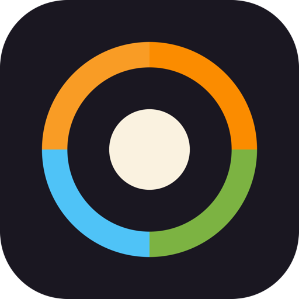
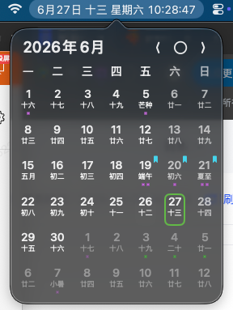
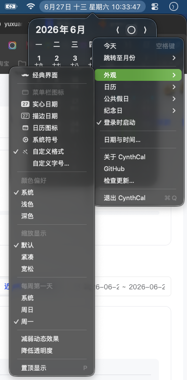
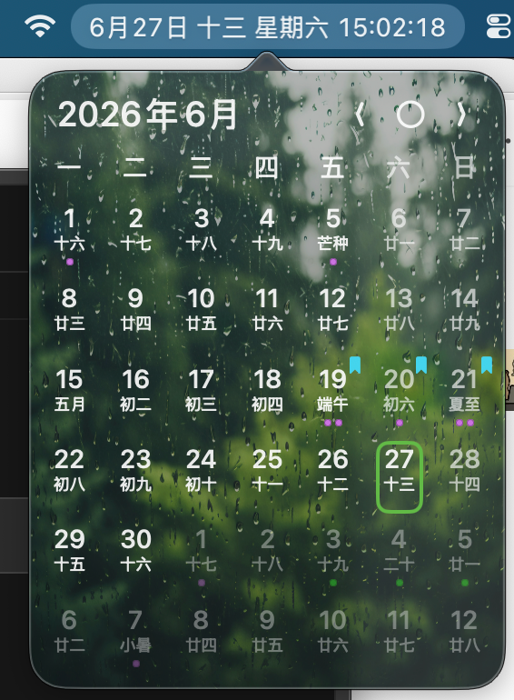

# CynthCal

  

完全免费且开源的 Mac 状态栏极简日历，支持农历、公共假日、系统日历及提醒等功能。

本仓库 fork 自 [cyan/LunarBar](https://github.com/LunarBar-app/LunarBar)（[libremac.github.io](https://libremac.github.io/)），在此感谢原作者的开源贡献。本 fork 在原版基础上做了增强，具体见下方[新特性](#本-fork-的新特性)。

 

## 安装 CynthCal

从 <a href="https://github.com/yuxuangezhu/CynthCal/releases/latest" target="_blank">latest release</a> 获取 `CynthCal.dmg` / `CynthCal.app`，打开后将 `CynthCal.app` 拖拽至 `Applications` 即可。

你也可以在 [releases](https://github.com/yuxuangezhu/CynthCal/releases) 页面浏览历史版本。

> 无需担心非 App Store 安装的可靠性，CynthCal 是沙盒应用，且经过签名和 [notarization](https://developer.apple.com/documentation/security/notarizing_macos_software_before_distribution) 认证。

## 本 fork 的新特性

在原版农历日历的基础上，本 fork 增加了以下功能：

- **农历 / 公历纪念日**：在状态栏日历中标记个人纪念日和生日，支持按农历或公历循环；提供独立的 GUI 管理窗口进行增删改。
- **天气日历背景**：日历面板背景根据当天天气自动切换氛围图（晴/云/雨/雪/雾/雷暴），数据来自 wttr.in，默认关闭，可按城市自定义。
- **时辰与干支**：自定义外观格式新增 `{{ lunarInfo('shichen') }}`（单字地支）、`{{ lunarInfo('shichenName') }}`（完整时辰名）、`{{ lunarInfo('ganZhi') }}`（年柱干支）。
- **周首日设置**：Appearance 菜单新增「每周第一天」选项（跟随系统 / 周日 / 周一）。
- **自定义图标字号**：可调整状态栏自定义文本图标的字号。
- **日期格交互优化**：单击选中、双击才在系统日历打开。

## 关于名字与图标

**CynthCal** 这个名字由两部分组成：**Cynth** 源自希腊神话中的月神辛西娅（Cynthia），是月亮的代称，呼应了农历（lunar）的核心意象；**Cal** 即 calendar（日历）。合在一起，意为「月之历」——一台以月亮为名的日历。

中文称之为**望月历**：「望」既是仰望月亮，也取「望月」（满月）之意，寄托对时光轮转的注视。

应用的图标是一个**四季色环**——圆环被均分为四等分，分别用嫩绿（春）、暖橙（夏）、金黄（秋）、冰蓝（冬）代表四季，中央的暖白圆点象征日轮。它呼应了版权页那句「人生日历三万天，春夏秋冬四季还」：人的一生约三万天，年复一年，四季轮回不止。

## 使用 CynthCal 的理由

如果你是这类人，欢迎试试：

- 日常使用 Mac
- 需要查看农历
- 需要查看公共假日
- 需要记录农历 / 公历纪念日
- 想要日历随天气变换氛围
- 喜欢极致的应用
- 喜欢简单的事物

请不要期待过高，CynthCal 的极简设计是经过深思熟虑的结果。当它不能满足你的需求时，不妨试试其他产品。

## 一些可能被问到的问题

**这是官方版本吗**

不是。这是基于 [cyan/LunarBar](https://github.com/LunarBar-app/LunarBar) 的二次开发版本（fork），由独立维护者增加了一些个人需要的功能。原作者的项目请见 [LunarBar-app/LunarBar](https://github.com/LunarBar-app/LunarBar)。

**为什么会有这个 fork**

原版 LunarBar 已经非常成熟，但缺少「按农历循环的个人纪念日」这一对中国用户很实用的功能，以及时辰、干支等传统文化元素的展示。本 fork 在尽量不破坏原版极简哲学的前提下补充了这些能力。

**原版的 Homebrew 安装还能用吗**

可以。原版仍可通过 `brew install --cask lunarbar` 安装。本 fork 的版本需从本仓库的 [releases](https://github.com/yuxuangezhu/CynthCal/releases) 获取。

**关于原版的开发动机、为什么不开发 iOS / 小组件等更多背景**

这些内容来自原作者，请直接参考原项目的 [README](https://github.com/LunarBar-app/LunarBar#readme)。
